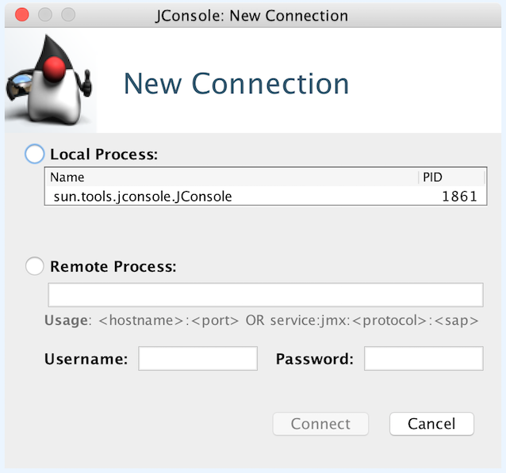
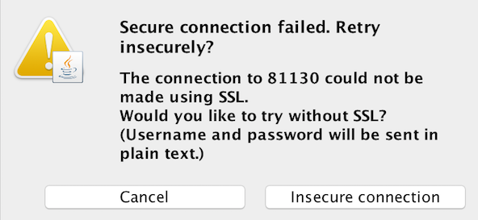
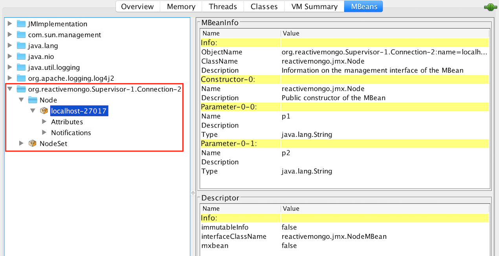

## Monitoring

A [JMX](https://en.wikipedia.org/wiki/Java_Management_Extensions) module is available.

When running with this module, you can check the state of the ReactiveMongo pools from outside the JVM, using a JMX client.

It can be enabled by adding the dependency as bellow.

```ocaml
"org.reactivemongo" %% "reactivemongo-jmx" % "{{site._0_12_latest_minor}}"
```

**Using JConsole:**

In order to monitor with `jconsole`, first start it and select the ReactiveMongo JVM.



The following warning may be display when connecting to a JVM without SSL (e.g. for local JVMs).



Once connected, you can select the "MBeans" tab on the top of JConsole, to check the beans managed in the JVM, including those representing the MongoDB nodes managed by ReactiveMongo.


