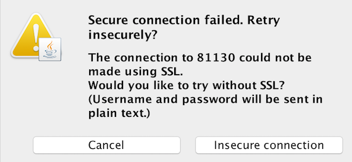
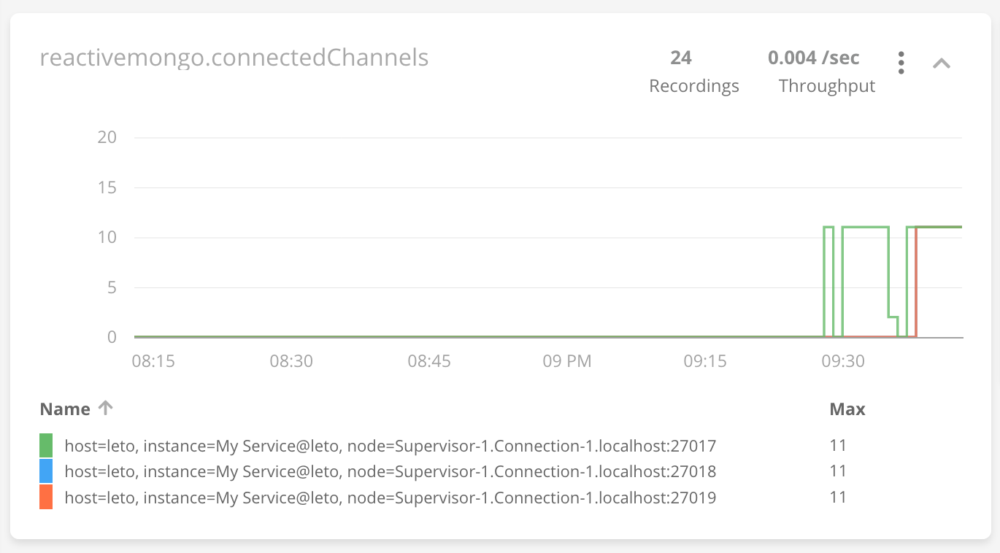

## Monitoring

ReactiveMongo provides a mechanism to collect some metrics about MongoDB connections, that can be useful to monitor.

## JMX

A [JMX](https://en.wikipedia.org/wiki/Java_Management_Extensions) module is available.

When running with this module, you can check the state of the ReactiveMongo pools from outside the JVM, using a JMX client.

It can be enabled by adding the dependency as bellow.


"org.reactivemongo" %% "reactivemongo-jmx" % "{{site._1_0_latest_minor}}"


**Using JConsole:**

In order to monitor with `jconsole`, first start it and select the ReactiveMongo JVM.

The following warning may be display when connecting to a JVM without SSL (e.g. for local JVMs).

Once connected, you can select the "MBeans" tab on the top of JConsole, to check the beans managed in the JVM, including those representing the MongoDB nodes managed by ReactiveMongo.

## Kamon

[Kamon](https://kamon.io/) is an instrumentation and monitoring library for JVM application.

For projects where Kamon is [set up](https://kamon.io/docs/latest/guides/), the module `reactivemongo-kamon` can to added as bellow, to collect metrics about the connection pools.


"org.reactivemongo" %% "reactivemongo-kamon" % "{{site._1_0_latest_minor}}"


Then the metrics can be configured in dashboards, according the used Kamon reporters.
For example if using [Kamon APM](https://kamon.io/docs/latest/reporters/apm/).

The collected metrics are the following.

**Pool metrics:** (tagged by pool name)
- `reactivemongo.awaitingRequests`: Total number of requests awaiting to be processed by MongoDB nodes.
- `reactivemongo.maxAwaitingRequestsPerChannel`: Maximum number of requests that were awaiting to be processed for a single channel (see `maxInFlightRequestsPerChannel`).
- `reactivemongo.numberOfNodes`: Number of nodes that are part of the set.
- `reactivemongo.hasPrimary`: Indicates whether the primary node is known (0 or 1).
- `reactivemongo.hasNearest`: Indicates whether the nearest node is known (0 or 1).
- `reactivemongo.isMongos`: Indicates whether mongos is used (0 or 1).
- `reactivemongo.numberOfSecondaries`: Number of secondary nodes in the set.
**Node metrics:** (tagged by pool & node)
- `reactivemongo.nodeChannels`: Number of network channels to a same MongoDB node, whatever is the status (see `connectedChannels`).
- `reactivemongo.connectedChannels`: Number of connected channels to a same MongoDB node (see `nodeChannels`).
- `reactivemongo.authenticatedChannels`: Number of authenticated channels to a same MongoDB node (see `connectedChannels`).
- `reactivemongo.pingTime`: Response delay (in nanoseconds) for the last IsMaster request.
