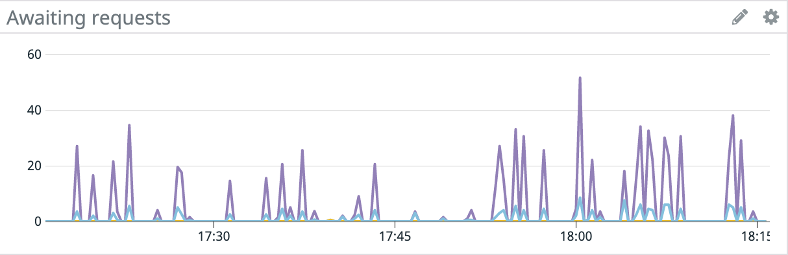

## Monitoring

ReactiveMongo provides a mechanism to collect some metrics about MongoDB connections, that can be useful to monitor.

**Supported:**

- [JMX](#jmx)
- [Kamon](#kamon)
- [Datadog](#datadog)
- [Instana](#instana)

## JMX

A [JMX](https://en.wikipedia.org/wiki/Java_Management_Extensions) module is available.

When running with this module, you can check the state of the ReactiveMongo pools from outside the JVM, using a JMX client.

It can be enabled by adding the dependency as bellow.

```ocaml
"org.reactivemongo" %% "reactivemongo-jmx" % "{{site._1_0_latest_minor}}"
```

**Using JConsole:**

In order to monitor with `jconsole`, first start it and select the ReactiveMongo JVM.


The following warning may be display when connecting to a JVM without SSL (e.g. for local JVMs).


Once connected, you can select the "MBeans" tab on the top of JConsole, to check the beans managed in the JVM, including those representing the MongoDB nodes managed by ReactiveMongo.


## Kamon

[Kamon](https://kamon.io/) is an instrumentation and monitoring library for JVM application.

For projects where Kamon is [set up](https://kamon.io/docs/latest/guides/), the module `reactivemongo-kamon` can to added as bellow, to collect metrics about the connection pools.

```ocaml
"org.reactivemongo" %% "reactivemongo-kamon" % "{{site._1_0_latest_minor}}"
```

Then the metrics can be configured in dashboards, according the used Kamon reporters.
For example if using [Kamon APM](https://kamon.io/docs/latest/reporters/apm/).


The collected metrics are the following.

**Spans/Events:** (tagged by pool name)

- `reactivemongo.pool-created`
- `reactivemongo.pool-updated`
- `reactivemongo.pool-stopped`

**Pool metrics:** (tagged by pool name)
- `reactivemongo.awaitingRequests`: Total number of requests awaiting to be processed by MongoDB nodes.
- `reactivemongo.maxAwaitingRequestsPerChannel`: Maximum number of requests that were awaiting to be processed for a single channel (see `maxInFlightRequestsPerChannel`).
- `reactivemongo.numberOfNodes`: Number of nodes that are part of the set.
- `reactivemongo.hasPrimary`: Indicates whether the primary node is known (0 or 1).
- `reactivemongo.hasNearest`: Indicates whether the nearest node is known (0 or 1).
- `reactivemongo.isMongos`: Indicates whether mongos is used (0 or 1).
- `reactivemongo.numberOfSecondaries`: Number of secondary nodes in the set.

**Node metrics:** (tagged by pool & node)
- `reactivemongo.nodeChannels`: Number of network channels to a same MongoDB node, whatever is the status (see `connectedChannels`).
- `reactivemongo.connectedChannels`: Number of connected channels to a same MongoDB node (see `nodeChannels`).
- `reactivemongo.authenticatedChannels`: Number of authenticated channels to a same MongoDB node (see `connectedChannels`).
- `reactivemongo.pingTime`: Response delay (in nanoseconds) for the last IsMaster request.

## Datadog

This library exposes the ReactiveMongo metrics using [StatsD integration for Datadog](https://docs.datadoghq.com/developers/dogstatsd/?tab=hostagent).

```ocaml
"org.reactivemongo" %% "reactivemongo-datadog" % "{{site._1_0_latest_minor}}"
```

**Events:** (tagged by pool name)

- `pool-created`
- `pool-updated`
- `pool-stopped`

**Pool metrics:** (tagged by pool name)

- `awaitingRequests`: Total number of requests awaiting to be processed by MongoDB nodes.
- `maxAwaitingRequestsPerChannel`: Maximum number of requests that were awaiting to be processed for a single channel (see `maxInFlightRequestsPerChannel`).
- `numberOfNodes`: Number of nodes that are part of the set.
- `hasPrimary`: Indicates whether the primary node is known (0 or 1).
- `hasNearest`: Indicates whether the nearest node is known (0 or 1).
- `isMongos`: Indicates whether mongos is used (0 or 1).
- `numberOfSecondaries`: Number of secondary nodes in the set.

**Node metrics:** (tagged by pool & node)

- `nodeChannels`: Number of network channels to a same MongoDB node, whatever is the status (see `connectedChannels`).
- `connectedChannels`: Number of connected channels to a same MongoDB node (see `nodeChannels`).
- `authenticatedChannels`: Number of authenticated channels to a same MongoDB node (see `connectedChannels`).
- `pingTime`: Response delay (in nanoseconds) for the last IsMaster request.



### Application configuration

The application using the driver must configure the Datadog monitoring using a file `application.conf` (or `reference.conf`), that [must be found in the classpath](https://github.com/lightbend/config/blob/master/HOCON.md#conventional-configuration-files-for-jvm-apps).

The following settings are mandatory.

- `reactivemongo.datadog.hostname`: Host to the DatadogD agent for metric/event collection (e.g. `localhost`).
- `reactivemongo.datadog.port` (integer): UDP/StatsD port of the DatadogD agent (e.g. `8125`).

> If `reactivemongo.datadog.hostname` is missing, the monitoring is not started.

**Minimal configuration sample:**

```
reactivemongo {
  datadog {
    hostname = "localhost"
    port = 8125
  }
}
```

The following settings are optional (see [documentation](https://javadoc.io/static/com.datadoghq/java-dogstatsd-client/2.10.5/com/timgroup/statsd/NonBlockingStatsDClient.html#NonBlockingStatsDClient-java.lang.String-int-java.lang.String:A-com.timgroup.statsd.StatsDClientErrorHandler-java.util.concurrent.Callable-int-int-int-java.lang.String-int-int-int-boolean-boolean-int-)).

- `reactivemongo.datadog.name`: The name for the application host who send the metrics.
- `reactivemongo.datadog.prefix`: The prefix/namespace to be added to all the metric keys (default: `reactivemongo`).
- `reactivemongo.datadog.constantTags`: The tags to be added to all metrics.
- `reactivemongo.datadog.bufferPoolSize` (unsigned integer): The socket buffer size in bytes. Applies to unix sockets only.
- `reactivemongo.datadog.entityID`: The entity id value used with an internal tag for tracking client entity.
- `reactivemongo.datadog.queueSize` (unsigned integer): The maximum amount of unprocessed messages in the queue.
- `reactivemongo.datadog.senderWorkers` (unsigned integer): The number of sender worker threads submitting buffers to the socket.
- `reactivemongo.datadog.socketBufferSize` (unsigned integer): Applies to unix sockets only.
- `reactivemongo.datadog.timeout` (finite duration; e.g. 2 seconds = `2000`): The timeout in milliseconds. Applies to unix sockets only.
- Telemetry:
  * `reactivemongo.datadog.telemetry.enabled` (boolean; default `false`): Enable telemetry.
  * `reactivemongo.datadog.telemetry.hostname`: Telemetry hostname.
  * `reactivemongo.datadog.telemetry.port` (unsigned integer): Telemetry port, if enabled.

> Datadog metric collection is always set in non-blocking mode.

*See [complete example](https://github.com/ReactiveMongo/ReactiveMongo-Monitoring/blob/{{site._1_0_latest_minor}}/datadog/src/test/resources/application.conf)*

**Troubleshooting:**

This can be debuged using [Netcat](https://fr.wikipedia.org/wiki/Netcat), using an alternative port (e.g. `8126`), to ensure the monitoring is properly started: `nc -u -l 8126 | grep reactivemongo`; Must display StatsD entries as bellow.

```
_e{40,461}:reactivemongo.reactivemongo.pool-created|MongoConnectionOptions { appName: Supervisor-1/Connection-1, authenticationMechanism: SCRAM-SHA-1, nbChannelsPerNode: 10, maxInFlightRequestsPerChannel: 200, minIdleChannelsPerNode: 1, heartbeatFrequencyMS: 10000ms, connectTimeoutMS: 0ms, maxIdleTimeMS: 0ms, tcpNoDelay: false, keepAlive: false, sslEnabled: false, sslAllowsInvalidCert: false, writeConcern: WriteConcern(WaitForAcknowledgments(1),false,false,None), readPreference: Primary, readConcern: local }|d:1605894402|h:myapp|k:Supervisor-1|t:info|s:reactivemongo|#Supervisor-1.Connection-1,Supervisor-1_e{26,113}:reactivemongo.pool-updated|{{NodeSet None Node[localhost:32770: Unknown (0/1 available connections), latency=9223372036854775807, auth=0] }}|d:1605894403|h:myapp|k:Supervisor-1|t:info|s:reactivemongo|#Supervisor-1.Connection-1,Supervisor-1reactivemongo.awaitingRequests:0|g|#Supervisor-1.Connection-1,Supervisor-1
reactivemongo.maxAwaitingRequestsPerChannel:0|g|#Supervisor-1.Connection-1,Supervisor-1
reactivemongo.numberOfNodes:1|g|#Supervisor-1.Connection-1,Supervisor-1
reactivemongo.hasPrimary:0|g|#Supervisor-1.Connection-1,Supervisor-1
reactivemongo.hasNearest:0|g|#Supervisor-1.Connection-1,Supervisor-1
reactivemongo.isMongos:0|g|#Supervisor-1.Connection-1,Supervisor-1
reactivemongo.numberOfSecondaries:0|g|#Supervisor-1.Connection-1,Supervisor-1
reactivemongo.nodeChannels:1|g|#localhost:32770,Supervisor-1.Connection-1,Supervisor-1
reactivemongo.connectedChannels:0|g|#localhost:32770,Supervisor-1.Connection-1,Supervisor-1
reactivemongo.authenticatedChannels:0|g|#localhost:32770,Supervisor-1.Connection-1,Supervisor-1
reactivemongo.pingTime:9223372036854775|g|#localhost:32770,Supervisor-1.Connection-1,Supervisor-1_e{26,113}:reactivemongo.pool-updated|{{NodeSet None Node[localhost:32770: Unknown (1/1 available connections), latency=9223372036854775807, auth=1] }}|d:1605894403|h:myapp|k:Supervisor-1|t:info|s:reactivemongo|#Supervisor-1.Connection-1,Supervisor-1
reactivemongo.awaitingRequests:0|g|#Supervisor-1.Connection-1,Supervisor-1
...
```

### Agent configuration

The mandatory setting `reactivemongo.datadog.hostname` must correspond to the accessible network address or hostname of the Datadog agent (e.g. `localhost` if the application and the agent are on the same machine).

Also the setting `reactivemongo.datadog.port` must match the way the Datadog agent is configured for StatsD (e.g `8125` in the following example).

First, edit `datadog.yml` and add the following settings:

```yaml
use_dogstatsd: true
dogstatsd_port: 8125 # UDP
```

After the agent is restarted, this can be [tested from shell](https://docs.datadoghq.com/developers/dogstatsd/datagram_shell/?tab=metrics).

```bash
while true; do ((echo -n "custom.metric.name:$RANDOM|c" | nc -4u -w1 ${DATADOGD_UDP_HOST} ${DATADOGD_UDP_PORT}) && sleep 1s); done
```

## Instana

Automatic ReactiveMongo Monitoring is part of Instana’s comprehensive microservices and cloud-native application monitoring solution.

*[See documentation](https://www.instana.com/supported-technologies/reactivemongo-monitoring/)*
